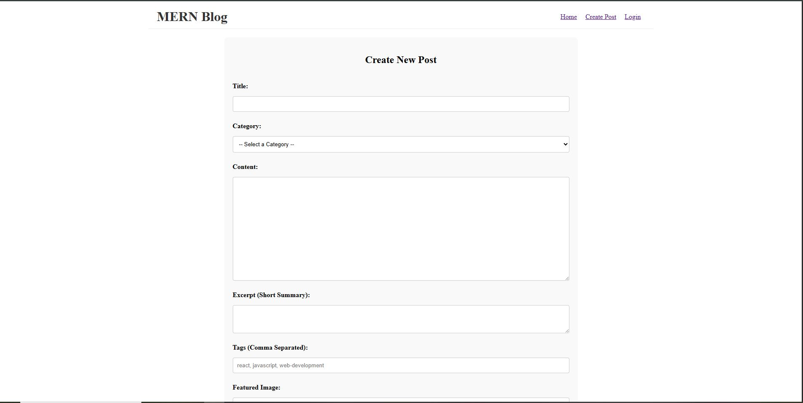
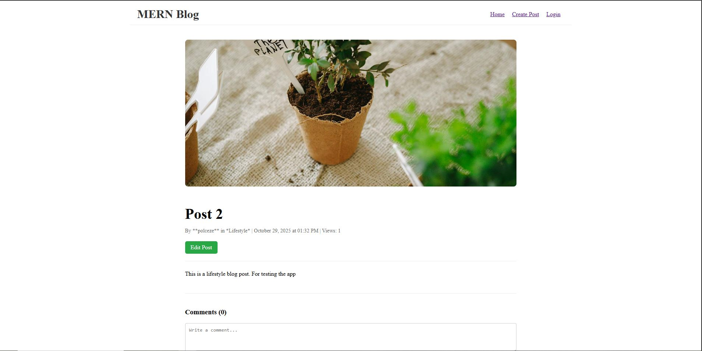

# Blogging Platform - MERN Stack Application

A full-stack blogging platform built with the MERN stack (MongoDB, Express.js, React, Node.js) that allows users to create, read, update, and delete blog posts with categories, tags, and featured images.

## 🚀 Project Overview
This is a modern blogging platform that provides a complete content management system for bloggers. The application features a responsive React frontend with a Node.js/Express backend, MongoDB for data storage, and comprehensive CRUD operations for blog posts.

### Key Features
- User Authentication - JWT-based authentication system
- Post Management - Create, read, update, and delete blog posts
- Categories & Tags - Organize posts with categories and tags
- Image Upload - Support for featured images
- Responsive Design - Mobile-friendly interface
- RESTful API - Clean API structure for frontend-backend communication

## 🛠️ Tech Stack
### Frontend
- React - UI framework
- React Router - Client-side routing
- Axios - HTTP client for API calls
- CSS-in-JS - Component styling

### Backend
- Node.js - Runtime environment
- Express.js - Web framework
- MongoDB - Database
- Mongoose - ODM for MongoDB
- JWT - Authentication
- Multer - File upload handling
- bcryptjs - Password hashing
- CORS - Cross-origin resource sharing

## 📋 Prerequisites
Before running this application, ensure you have the following installed:

- Node.js (v14 or higher)
- MongoDB (local installation or MongoDB Atlas account)
- npm or yarn package manager

## ⚙️ Setup Instructions

### 1. Clone the Repository
```bash
git clone <repository-url>
cd blogging-platform
```

### 2. Backend Setup
```bash 
# Navigate to backend directory
cd backend

# Install dependencies
npm install

# Environment Configuration
# Create a .env file in the backend directory with:
MONGODB_URI=mongodb://localhost:27017/blogging-platform
JWT_SECRET=your_jwt_secret_key_here
PORT=5000
```

### 3. Frontend Setup
```bash
# Navigate to frontend directory (from root)
cd frontend

# Install dependencies
npm install

# Environment Configuration (if needed)
# Create a .env file in the frontend directory:
REACT_APP_API_URL=http://localhost:5000/api
```

### 4. Database Setup

#### Option 1: Local MongoDB
```bash
# Make sure MongoDB is running on your local machine
mongod
```
#### Option 2: MongoDB Atlas

- Create a free account at [MongoDB Atlas](https://www.mongodb.com/atlas)
- Create a cluster and get your connection string
- Update the `MONGODB_URI` in your backend `.env` file

### 5. Running the Application
Start the Backend Server:

```bash
cd backend
npm run dev
# Server runs on http://localhost:5000
```

Start the Frontend Development Server:

```bash
cd frontend
npm start
# Application runs on http://localhost:3000
```

### 6. Initial Setup (Optional)
The application should work out of the box. If you want to seed initial data (categories, sample posts), you can run:

```bash
cd backend
npm run seed
```

## 📚 API Documentation

### Authentication Endpoints

| Method | Endpoint | Description | Body |
|--------|----------|-------------|------|
| POST | `/api/auth/register` | User registration | `{ username, email, password }` |
| POST | `/api/auth/login` | User login | `{ email, password }` |

### Post Endpoints

| Method | Endpoint | Description | Parameters |
|--------|----------|-------------|------------|
| GET | `/api/posts` | Get all posts | `?page=1&limit=10` |
| GET | `/api/posts/:id` | Get single post | - |
| POST | `/api/posts` | Create new post | FormData |
| PUT | `/api/posts/:id` | Update post | FormData |
| DELETE | `/api/posts/:id` | Delete post | - |

### Category Endpoints

| Method | Endpoint | Description |
|--------|----------|-------------|
| GET | `/api/categories` | Get all categories |
| POST | `/api/categories` | Create category |
| GET | `/api/categories/:id` | Get category with posts |
### Request/Response Examples

#### Create Post:
```text
POST /api/posts
Content-Type: multipart/form-data

Body:
- title: string (required)
- content: string (required)
- category: string (required)
- excerpt: string
- tags: string (comma separated)
- featuredImage: file
```

Response:
```json
{
  "success": true,
  "data": {
    "_id": "post_id",
    "title": "Post Title",
    "content": "Post content...",
    "category": { "_id": "cat_id", "name": "Technology" },
    "tags": ["react", "javascript"],
    "featuredImage": "image_url",
    "createdAt": "2024-01-01T00:00:00.000Z"
  }
}
```
## 🎯 Features Implemented
### ✅ Core Features
- User authentication (register/login)
- Create, read, update, delete posts
- Category management
- Tag system for posts
- Featured image upload
- Responsive design
- Post excerpt/summary

### ✅ User Interface
- Homepage with all posts grid layout
- Individual post detail pages
- reate/edit post form
- Category filtering
- Loading states and error handling
- Success/error notifications

### ✅ Backend Features
- RESTful API design
- JWT authentication middleware
- File upload handling with Multer
- Input validation and sanitization
- Error handling middleware
- CORS configuration

### ✅ Data Management
- MongoDB database with Mongoose ODM
- Post-Category relationships
- User-Post relationships
- Image storage and retrieval
- Data validation at schema level

## 🗂️ Project Structure

```
mern-stack-integration-Polceze/
├─ client/
│  ├─ src/
│  │  ├─ assets/
│  │  ├─ components/
│  │  │  ├─ posts/
│  │  │  │  └─ PostCard.jsx
│  │  │  ├─ CreateCategory.jsx
│  │  │  ├─ ErrorBoundary.jsx
│  │  │  └─ SearchFilter.jsx
│  │  ├─ context/
│  │  │  ├─ AuthContext.jsx
│  │  │  └─ AuthProvider.jsx
│  │  ├─ hooks/
│  │  │  ├─ useAuth.js
│  │  │  └─ useFetch.js
│  │  ├─ pages/
│  │  │  ├─ CreatePostPage.jsx
│  │  │  ├─ HomePage.jsx
│  │  │  ├─ LoginPage.jsx
│  │  │  ├─ PostDetails.jsx
│  │  │  └─ RegisterPage.jsx
│  │  ├─ services/
│  │  │  └─ api.js
│  │  ├─ App.css
│  │  ├─ App.jsx
│  │  ├─ index.css
│  │  └─ main.jsx
│  ├─ index.html
├─ server/
│  ├─ controllers/
│  │  ├─ authController.js
│  │  ├─ categoryController.js
│  │  ├─ commentController.js
│  │  └─ postController.js
│  ├─ middleware/
│  │  ├─ authMiddleware.js
│  │  └─ upload.js
│  ├─ models/
│  │  ├─ Category.js
│  │  ├─ Post.js
│  │  └─ User.js
│  ├─ routes/
│  │  ├─ auth.js
│  │  ├─ categories.js
│  │  └─ posts.js
│  ├─ uploads/
│  ├─ utils/
│  │  └─ errorResponse.js
│  ├─ seedCategories.js
│  └─ server.js
└─ README.md
```

## 🔧 Environment Variables
#### Backend (.env)
```env
MONGODB_URI=mongodb://localhost:27017/blogging-platform
JWT_SECRET=your_super_secret_jwt_key
PORT=5000
NODE_ENV=development
```

#### Frontend (.env)
```env
REACT_APP_API_URL=http://localhost:5000/api
```

## 📝 Available Scripts

### Backend Scripts
```bash
npm start          # Start production server
npm run dev        # Start development server with nodemon
npm run seed       # Seed database with sample data
```

### Frontend Scripts
```bash 
npm start          # Start development server
npm run build      # Build for production
npm test           # Run tests
```

## 🤝 Contributing
1. Fork the repository
2. Create a feature branch: git checkout -b feature/amazing-feature
3. Commit your changes: git commit -m 'Add amazing feature'
4. Push to the branch: git push origin feature/amazing-feature
5. Open a pull request

## 📄 License
This project is licensed under the MIT License.

## 👥 Authors
- Paul Ochieng - Initial work

## 🙏 Acknowledgments
- MERN stack community
- MongoDB University
- React documentation
- Express.js team

## 📸 Screenshots

<div align="center">

#### Homepage


#### Create Post Page



#### Post Detail Page

</div>

